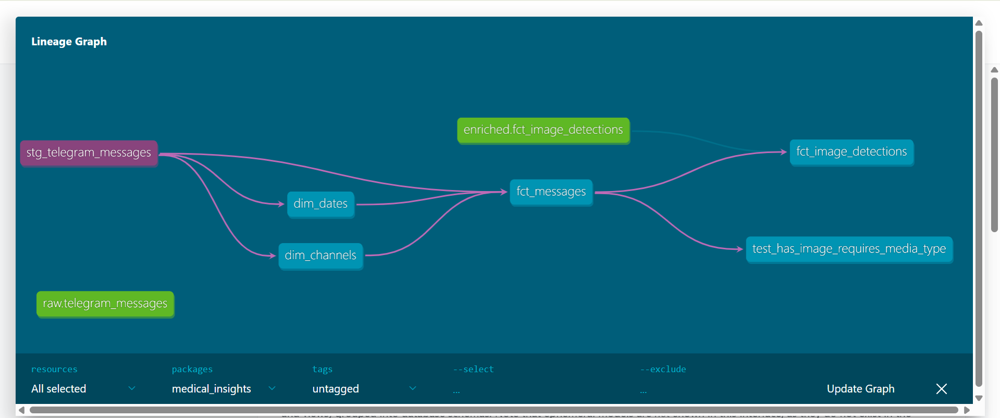
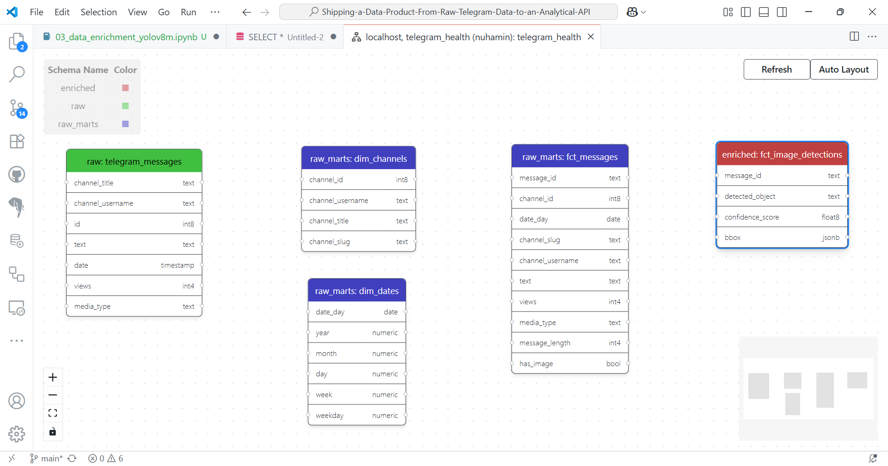

# Shipping a Data Product From Raw Telegram Data to an Analytical API

[](https://github.com/nuhaminae/Shipping-a-Data-Product-From-Raw-Telegram-Data-to-an-Analytical-API/actions/workflows/CI.yml)

## Overview
This project builds an analytical data product by extracting Telegram message data from Ethiopian medical channels, transforming it into a clean star schema using dbt, enriching it with image classification via YOLOv8, and ultimately exposing key insights through a FastAPI backend. It is designed for reproducibility, modularity, and trust.

## Key Features
- Raw Telegram data scraped with Telethon and stored in structured JSON
- PostgreSQL warehouse with dbt-powered modelling
- Star schema with staging, dimensional, and fact models
- Built-in and custom tests for data integrity and business logic
- Lineage graph and model documentation via dbt docs
- Future integration of YOLOv8 image tagging and FastAPI endpoints (Next steps)

## Table of Contents
- [Project Background](#project-background)
- [Data Sources](#data-sources)
- [Project Structure](#project-structure)
- [Installation](#installation)
- [Usage](#usage)
- [Contribution](#contribution)
- [Project Status](#project-status)

## Project Background
Medical products in Ethiopia are recently being promoted through Telegram channels. This project aims to mine structured insights from that stream — such as message activity, product visibility, and channel engagement — by turning raw scraped messages into a fully analytical warehouse.

The challenge focuses on turning unstructured channel data into:
- A reproducible pipeline
- Enriched metrics
- API-ready insights

## Data Sources
- Telegram channels related to Ethiopian health and medicine
- Scraped message data (text, views, media_type, date, etc.)
- Images linked to messages for further enrichment via YOLOv8 (Next steps)

## Project Structure
    ```
    Shipping-a-Data-Product-From-Raw-Telegram-Data-to-an-Analytical-API/
    ├── .dvc/
    ├── .github/workflows/
    ├── ...
    ├── .televenv/                               # Virtual environment (not committed)
    ├── data/
    │   └── raw/
    │       └── telegram_messages/ ...           # Raw Telegram data files
    ├── logs/                                    # Log files for tracking 
    ├── medical_insights/
    │   ├── ...
    │   ├── models/
    │   │   ├── marts/                           # Data marts for analytical purposes
    │   │   │   ├── dm_channels.sql
    │   │   │   ├── dm_messages.yml
    │   │   │   └── ...
    │   │   └── staging/                         # Staging models for raw data transformation
    │   │       ├── stg_telegram_messages.sql
    │   │       └── stg_telegram_messages.yml
    │   ├── ...
    │   ├── tests/                               # dbt tests for data integrity    
    │   ├── .gitignore
    │   ├── dbt_project.yml
    │   └── README.md
    ├── notebooks/
    │   ├── 01_data_scrapping.ipynb
    │   └── 02_data_loading.ipynb
    ├── plots/
    │   └── 01_lineage_graph.png                # DAG lineage screenshot
    ├── scripts/
    │   ├── __init__.py
    │   ├── _01_scraper.py
    │   └── _02_data_loader.py
    ├── ...
    ├── .gitignore
    ├── .pre-commit-config.yaml                  # Pre-commit hooks configuration
    ├── docker-compose.yml                       # Docker Compose file for multi-container applications
    ├── Dockerfile                               # Dockerfile for building the application image
    ├── pyproject.toml                           # Black configuration file
    ├── requirements-docker.txt                  # Docker-specific Python dependencies
    ├── requirements.txt                         # Python dependencies for the project
    └── README.md
    ```

## Installation

### Prerequisites

- Python 3.8 or newer (Python 3.12 recommended)
- `pip` (Python package manager)
- [DVC](https://dvc.org/) (for data version control)
- [Git](https://git-scm.com/)

### Steps
1. **Clone the repository:**
    ```
    git clone https://github.com/nuhaminae/Shipping-a-Data-Product-From-Raw-Telegram-Data-to-an-Analytical-API

    cd Intelligent-Complaint-Analysis-for-Financial-Services
    ```
2. **Create a virtual environment:**
   ```
    python -m venv .chatvenv

    # On Windows:
    .chatvenv\Scripts\activate

    # On Unix/macOS:
    source .chatvenv/bin/activate
    ```
3. **Install dependencies:**
    ```
    pip install -r requirements.txt
    ```
4. **(Optional) Set up DVC:**
    ```
    dvc pull
    ```

## Usage
- Run scraper to collect Telegram messages : `scripts/_01_scraper.py`
- Load JSON files into PostgreSQL: `scripts/_02_data_loader.py`
- Build models with dbt
``` bash
    dbt build
```
- Run integrity tests
``` bash
    dbt test
```
- Generate docs and view lineage graph
``` bash
    dbt docs generate
    dbt docs serve
```

Open docs at http://localhost:8080

[dbt docs](http://localhost:8080/#!/overview/medical_insights)





## Contribution
Contributions are welcome! Please fork the repository and submit a pull request. For major changes, open an issue first to discuss what you would like to change.

Make sure to follow best practices for version control, testing, and documentation.

## Project Status
**Completed**

- **Environment Setup**: Dockerised dev setup with reproducible virtual environment, `.env` and `.gitignore` in place.
- **Data Scraping**: Collected raw Telegram messages using Telethon and stored as structured JSON with logging.
- **PostgreSQL Load**: JSONs ingested into `raw.telegram_messages` using custom loader script.
- **dbt Modelling**:
  - Models built in `medical_insights/models/`
  - Created `stg_telegram_messages` with composite `message_id`
  - Built `dim_channels`, `dim_dates`, and `fct_messages` with full star schema design
- **Testing**:
  - Applied `not_null` and `unique` schema tests to keys and critical fields
  - Implemented custom test: *has_image → media_type must not be null* `tests/test_has_image_required.sql`
  - All tests pass (`dbt test` status: passed)
- **Documentation**:
  - Column descriptions and metadata added via `.yml` files
  - DAG lineage visualised in `dbt docs` and linked in `plots/01_lineage_graph.png`
  - Clean and contextual `README.md` provided for onboarding

**Next Steps**

- YOLOv8 image tagging for messages with visual media
- Creation of `fct_image_detections` model with object detection outputs
- FastAPI deployment with endpoints like:
  - `/api/channels/{channel}/activity`
  - `/api/reports/top-products`
  - `/api/search/messages?query=...`

---
Project underway, checkout the commit history [here](https://github.com/nuhaminae/Shipping-a-Data-Product-From-Raw-Telegram-Data-to-an-Analytical-API/commits?author=nuhaminae). 
